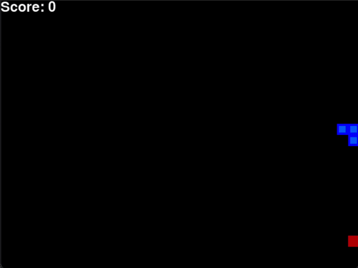
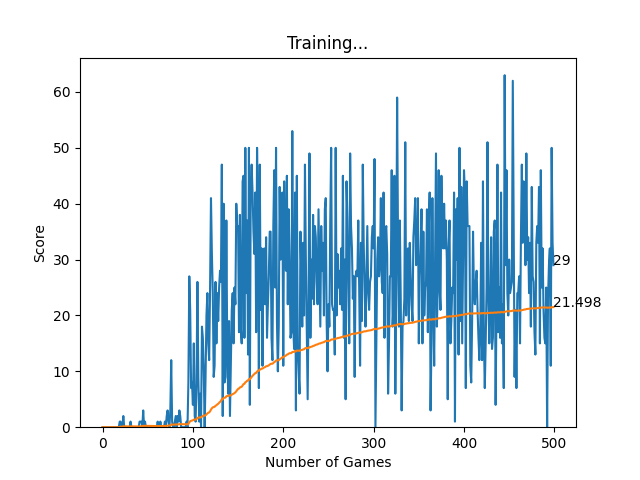
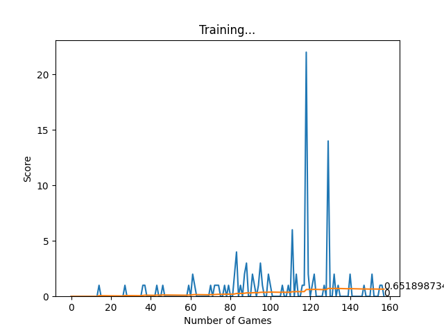
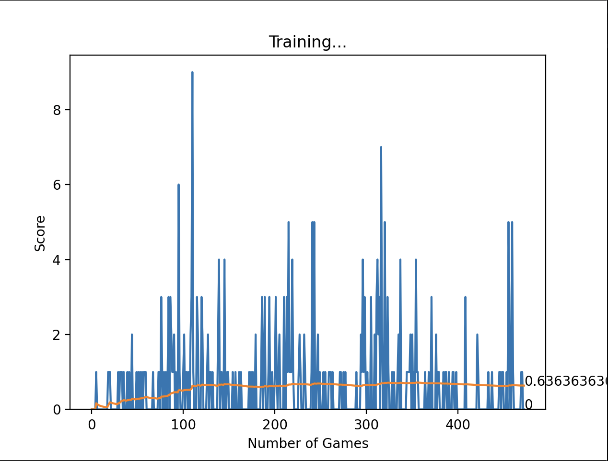

# Autonomous Snake AI: Deep Q-Learning Architecture

<p align="center">
  
  &nbsp; &nbsp;
  
  <br><br>
  <i><b>Left:</b> Agent gameplay after 500 training games.  &nbsp; &nbsp; <b>Right:</b> Final training convergence (Mean Score: 21.498).</i>
</p>

## Overview
This repository implements an autonomous agent that learns to play Snake entirely from scratch using a custom Reinforcement Learning environment.The agent utilizes a Feed-Forward Neural Network optimized via the Q-Learning algorithm.

## Architecture & State Space
The model evaluates an 11-dimensional boolean tensor representing its immediate state.
* **Danger Vectors:** Straight, Right, Left boundaries (walls and own tail).
* **Directional State:** Up, Down, Left, Right (one-hot encoding).
* **Target Trajectory:** Relative position of the food (Up, Down, Left, Right).

**The Neural Network Brain:**
* **Topology:** `Linear_QNet(Input: 11 -> Hidden: 256 -> Output: 3)`
* **Output:** A 3-element tensor representing the expected future reward (Q-Value) for taking action: `[Straight, Right Turn, Left Turn]`.
* **Optimization:** Adam Optimizer, Mean Squared Error (MSE) loss function.

**The Mathematics (Bellman Equation):**
The agent iteratively updates its policy using the Bellman Equation to balance immediate rewards with optimal future pathfinding:
$$Q_{new}(s, a) = R + \gamma \max_{a'} Q(s', a')$$

## Training Iterations & Architectural Evolution
The architecture was developed through three primary iterations to tune the Bellman equation parameters and address standard reinforcement learning challenges.

### Iteration 1: Baseline Architecture & Catastrophic Forgetting

<p align="center">
  
  <br>
  <i>Figure 1: The model reaches an early peak of 22 before gradient shock collapses the mean score to 0.65.</i>
</p>

* **Action:** Initialized the model with a discount factor of $\gamma=0$, a high learning rate of $LR=0.007$, and a steep, linear exploration ($\epsilon$) decay.
* **Outcome:** The agent failed to learn consistent pathfinding and exhibited catastrophic forgetting, where scores wildly fluctuated and failed to stabilize.
* **Reason:** Setting $\gamma=0$ collapsed the Bellman equation to $Q(s,a) = R$. This mathematically restricted the network to only value immediate rewards, making the agent incapable of planning routes to food that was multiple steps away. Additionally, the aggressive $0.007$ learning rate caused the optimizer to drastically overwrite network weights upon collision, destroying previously established logic.

### Iteration 2: Starvation Penalty Attempt

<p align="center">
  
  <br>
  <i>Figure 2: Reward hacking causes the model to stagnate entirely, plateauing at a mean score of 0.63.</i>
</p>

* **Action:** Introduced a continuous negative step penalty to encourage the agent to find the absolute shortest path to the food and avoid looping.
* **Outcome:** Training stalled. The agent frequently collided with walls immediately after spawning.
* **Reason:** Reward hacking. The network mathematically determined that exploring the board to find food resulted in a slow, continuous accumulation of negative points. To optimize its loss function, the agent learned to intentionally end the game immediately to take a flat reset penalty rather than bleeding points over hundreds of steps.

### Iteration 3: Production Convergence (Final Implementation)
* **Action:** Applied the final hyperparameters: increased foresight ($\gamma=0.9$), lowered learning rate ($LR=0.001$), and implemented a smooth multiplicative epsilon decay ($\epsilon_{dec}=0.995$) with a hard 1% exploration floor ($\epsilon_{min}=0.01$). Replaced the continuous step penalty with a strict starvation frame-limit based on snake length.
* **Outcome:** The model achieved stable mathematical convergence. The agent successfully navigated complex late-game board states, plateauing at a high mean score of **21.498** with consistent peak scores over 500+ games.
* **Reason:** 1. $\gamma=0.9$ allowed the neural network to prioritize long-term future rewards, solving the pathfinding limitation.
  2. $LR=0.001$ enabled smooth gradient descent, preventing weight destruction during late-game collisions. 
  3. The $0.995$ $\epsilon$ decay curve with a 1% floor ensured thorough initial state-space exploration while permanently preventing the agent from getting trapped in deterministic local minima. 
  4. The starvation frame-limit successfully prevented infinite looping without corrupting the reward mapping for individual steps.

## Local Execution
```bash
# Clone repository
git clone [https://github.com/KrishnanshPuri/snake_ai_game.git](https://github.com/KrishnanshPuri/snake_ai_game.git)
cd snake_ai_game

# Install dependencies
pip install -r requirements.txt

# Train a new model from scratch
python agent.py

# Run the converged production model (Showcase Mode)
python play.py
